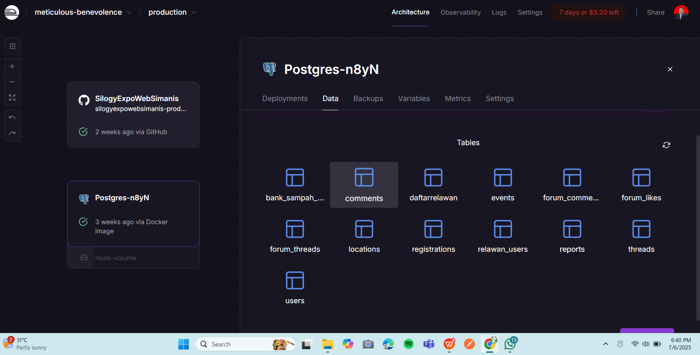

# 🌱 **WargaBuatin — Platform Aksi Hijau Digital**

*WargaBuatin adalah platform digital untuk mendorong kesadaran dan aksi nyata dalam menjaga lingkungan.  
Mengintegrasikan peta interaktif, laporan lingkungan, edukasi, forum komunitas, dan event sosial — ditenagai oleh backend dinamis dan frontend interaktif.*

**Versi:** 1.0.0  

*Built with the tools and technologies:*

---

**Developer:**  
- 🛠 **Backend:** Christian J. Hutahaean  
- 🎨 **Frontend:** Elkana M. Yosafat Sitorus

  
## 🖼️ Galeri Tampilan Aplikasi

### 🔐 Login
#### 🖥️ Tampilan Login Desktop

#### 📱 Tampilan Login Android

---

### 📝 Halaman Daftar
#### 🖥️ Daftar Desktop

#### 📱 Daftar Android

---

### 🏠 Beranda

---

### 🔒 Lupa Password - Tahap 1
#### 🖥️ Desktop

#### 📱 Android

---

### 👥 Tim Kami

---

### 🙋‍♂️ Relawan

---

### 🗺️ Laporan & Peta Aksi
#### 📌 Peta Aksi di Beranda

#### 📝 Laporan Kerusakan Lingkungan

---

### 🌳 Lokasi Hijau

---

### 🧺 Bank Sampah

---

### 🌱 Event Tanam Pohon

---

### 🗃️ Tampilan Database (Admin/Backend)

  ## 🎥 Video Penjelasan Website

Klik gambar di bawah ini untuk menonton penjelasan lengkap WargaBuatin di YouTube:

Railway  : [https://s-ilogy-s-imanis-fe-git-main-tiannamamus-projects.vercel.app/login](https://silogyexpowebsimanis-production.up.railway.app/)

Vercel   : https://s-ilogy-s-imanis-fe-git-main-tiannamamus-projects.vercel.app/login

